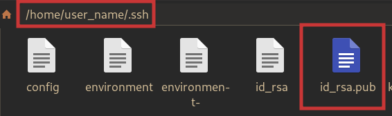
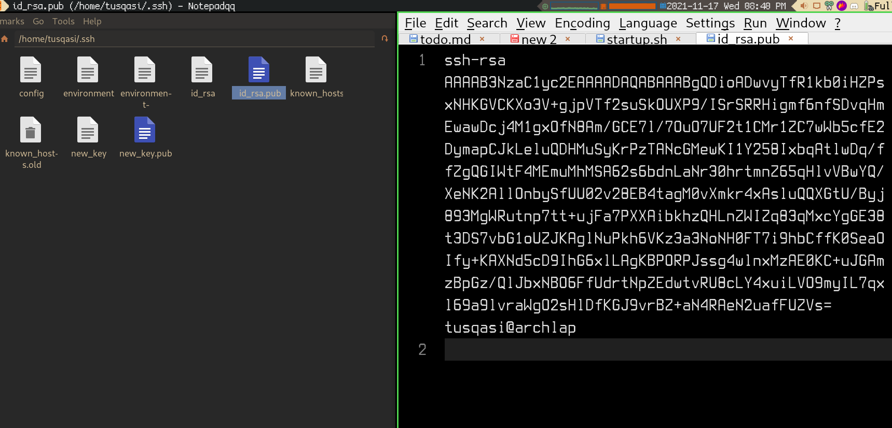
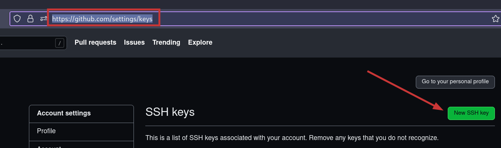

### Cloning repos

Our repos are not *public*, they are *private*. To be able to clone any repo from a private repo you need to make a ssh key.( GitHub does not allow using username and password to work with cloning just a few weeks ago.)

You will need to create a new `ssh key pair` (a private part and a public part), and then give that public part of the key to GitHub.


Run this command to create `ssh key pair`
```
ssh-keygen
```

Then proceed by press Enter three times

This is an example output
```
Generating public/private rsa key pair.
Enter file in which to save the key (/home/user_name/.ssh/id_rsa):
Enter passphrase (empty for no passphrase):
Enter same passphrase again:
Your identification has been saved in /home/user_name/.ssh/id_rsa
Your public key has been saved in /home/user_name/.ssh/id_rsa.pub
The key fingerprint is:
SHA256:37Y/ljk/5vLXNErWKlOIdfndkax1D0w4Dvk=\Q+oVOo user_name@hostname
The key's randomart image is:
+---[RSA 3072]----+
|           .Bo+o.|
|          ..++.*o|
|         ..  .=.+|
|         .. .oo0 |
|        T E   =o |
|         . . =+=.|
|          . = C+=|
|           o.BB+*|
|            B=BB=|
+----[SHA256]-----+
```

Add the key to the ssh-server
```
ssh-add
```
After running the `ssh-keygen` command your new `ssh key pair` is stored in `~/.ssh/` folder. We need to paste the public key into GitHub.

Open the `id_rsa` file in a text editor and copy the contents.




Go to this link to modify or add ssh keys to your GitHub account. [Add-ssh-keys](./assets/imgs/add_public_key.png)  


Name it something useful and Paste the key into the bottom text field  
 

Now you can clone the repos with  

```
git clone <repo-url>
```
